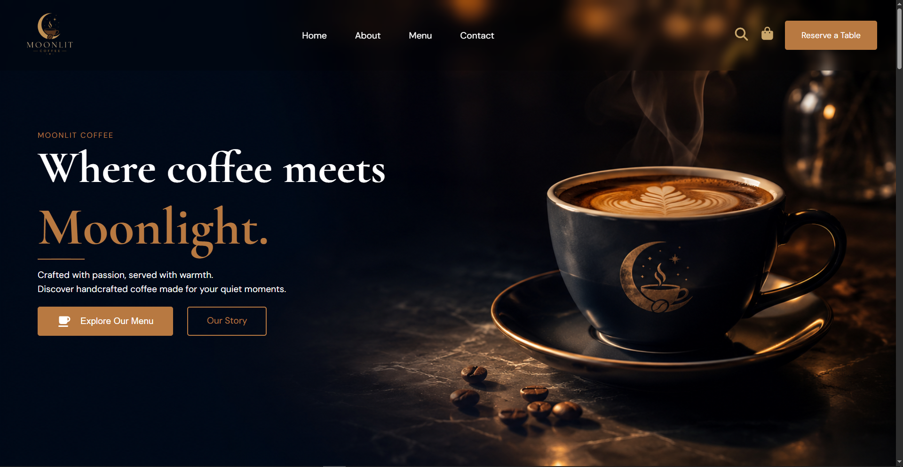
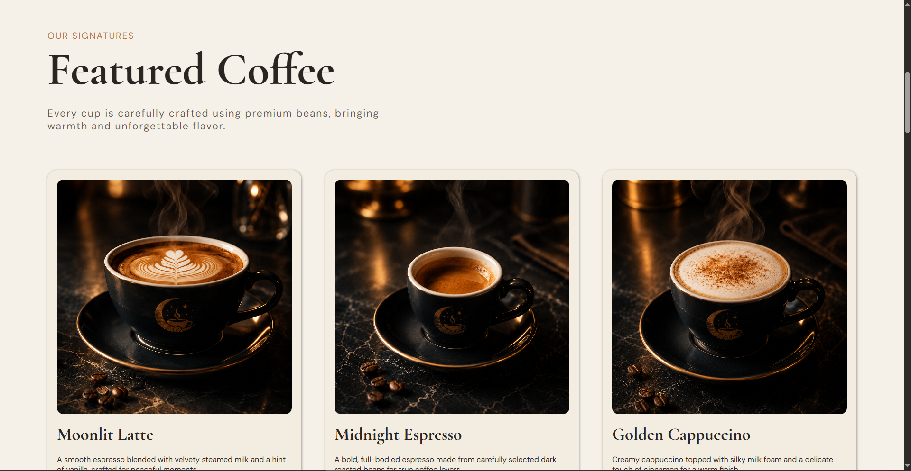
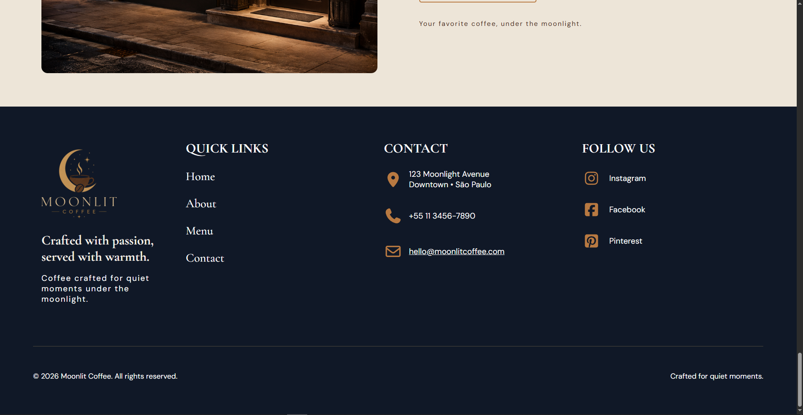

# ☕ Moonlit Coffee

Uma landing page de uma cafeteria fictícia, desenvolvida para praticar e aprimorar conhecimentos em **HTML5 e CSS3**.

O projeto apresenta uma identidade visual inspirada na combinação entre **café e a atmosfera da noite**, utilizando uma paleta de tons quentes e elementos visuais que reforçam essa proposta.

## ✨ Preview







> **Observação:** substitua o caminho acima pelo local onde você colocar o screenshot do projeto.

## 🎯 Sobre o projeto

O **Moonlit Coffee** foi desenvolvido como um projeto de estudo e portfólio, com foco na construção de uma interface completa utilizando apenas **HTML e CSS**.

A proposta foi ir além de uma página simples, trabalhando diferentes seções, componentes, hierarquia visual e adaptação da interface para diferentes tamanhos de tela.

### Principais seções

* Hero / apresentação
* Cafés em destaque
* Nossa história
* Experiência Moonlit Coffee
* Cardápio
* Localização e informações da cafeteria
* Footer

## 🛠️ Tecnologias utilizadas

* **HTML5** — estrutura e organização do conteúdo
* **CSS3** — estilização, layouts, animações e responsividade
* **CSS Grid** — construção de layouts
* **Flexbox** — alinhamento e organização dos elementos
* **Media Queries** — adaptação para diferentes tamanhos de tela
* **Google Fonts** — tipografia do projeto

## 📱 Responsividade

A página foi desenvolvida pensando em diferentes dispositivos e tamanhos de tela.

Foram utilizados diferentes breakpoints para adaptar:

* Estrutura dos grids
* Organização dos elementos
* Tamanhos de fontes
* Espaçamentos
* Imagens
* Botões
* Menu de navegação
* Seções do conteúdo
* Footer

O objetivo foi manter uma experiência consistente tanto em **desktop quanto em tablets e smartphones**.

## 🎨 Identidade visual

A identidade visual do projeto foi construída em torno do conceito **"Moonlit Coffee"**, combinando elementos relacionados ao café com uma atmosfera noturna.

A paleta utiliza principalmente:

* Tons claros e neutros para as seções principais
* Tons escuros para criar contraste
* Tons de caramelo e dourado para destaques
* Tipografia serifada para títulos
* Tipografia sans-serif para textos e elementos de interface

## 📂 Estrutura do projeto

```text
landingpage-moonlit-coffee/
│
├── assets/
│   └── images/
│
├── css/
│   ├── style.css
│   └── media.css
│
├── index.html
└── README.md
```

## 🚀 Acesse o projeto

🌐 **GitHub Pages:**
https://matheussilveira-dev.github.io/moonlit-coffee/

💻 **Repositório:**
https://github.com/matheussilveira-dev/moonlit-coffee

## 📚 O que pratiquei

Durante o desenvolvimento deste projeto, pude praticar e consolidar conhecimentos em:

* Estruturação de páginas com HTML5
* Organização e reutilização de CSS
* CSS Grid e Flexbox
* Variáveis CSS com `:root`
* Responsividade com Media Queries
* Hierarquia visual e tipografia
* Criação de componentes visuais
* Estados de interação com `:hover`
* Adaptação de layouts para diferentes dispositivos
* Organização de um projeto para publicação

## 📈 Próximos passos

Este projeto faz parte do meu processo de aprendizado em desenvolvimento web.

Algumas melhorias que podem ser exploradas futuramente:

* Adicionar interações com JavaScript
* Criar funcionalidades para o cardápio
* Adicionar um sistema de pedidos
* Melhorar algumas interações da interface
* Explorar acessibilidade e otimização

## 👨‍💻 Autor

**Matheus**

Projeto desenvolvido para fins de estudo e portfólio.

---

⭐ Se você gostou do projeto, considere deixar uma estrela no repositório!
